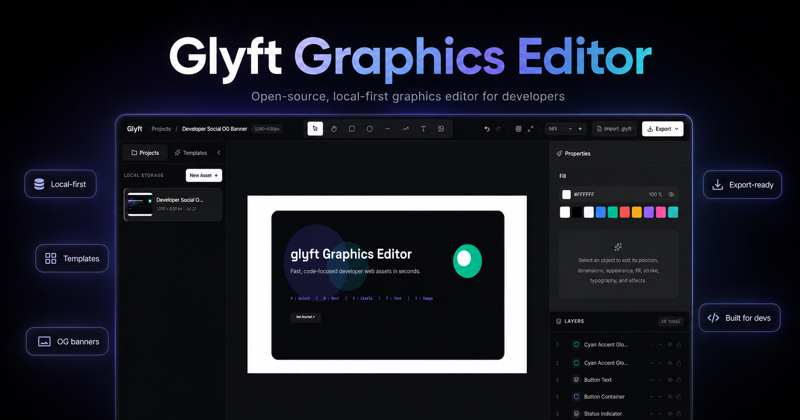

<div align="center">

# Glyft

**Open-source graphics editing for developers who are not designers.**

Create OG images, banners, social cards, thumbnails, and other web assets in a local-first browser editor.

[Open Glyft](https://glyft.vercel.app) · [Launch the editor](https://glyft.vercel.app/editor) · [Report an issue](https://github.com/cadornajansen/glyft/issues) · [Contribute](CONTRIBUTING.md)

[](https://github.com/cadornajansen/glyft/actions/workflows/ci.yml)
[](LICENSE)
[](https://github.com/cadornajansen/glyft/releases)
[](https://github.com/cadornajansen/glyft/issues)



</div>

## What is Glyft?

Glyft is a browser-based graphics editor designed around a developer workflow. It provides a focused canvas, familiar editing controls, local project storage, portable templates, and production-ready export formats without requiring an account or backend service.

Projects are stored in IndexedDB on the current device. The editor runs entirely in the browser and is available at [`/editor`](https://glyft.vercel.app/editor).

> **Status:** `v0.1.0` is a prerelease. Core editing and export workflows are usable, but some edge cases and advanced recovery behavior are still being refined.

## Highlights

- Artboard-based editing with pan and zoom
- Text, shapes, lines, arrows, images, and SVG image import
- Fill, stroke, opacity, typography, shadows, and transforms
- Layer naming, visibility, locking, grouping, and reordering
- Undo and redo history
- Local-first project persistence with autosave
- PNG, JPEG, WebP, and SVG export
- Portable `.glyft` template import and export
- High-resolution raster export
- Keyboard shortcuts and compact canvas controls

## Why local-first?

Glyft does not require an account or application backend for the editor itself. Project data remains in the browser unless you explicitly export it.

This makes the app useful for quick developer-facing assets while keeping the workflow simple:

```text
open editor → create asset → export file
```

No sign-in, upload queue, or server-side project storage is required.

## Tech stack

| Area | Technology |
| --- | --- |
| Interface | React 19, TypeScript, Tailwind CSS |
| Canvas | Fabric.js |
| Application state | Zustand |
| Local persistence | Dexie, IndexedDB |
| Build tooling | Vite |
| Tests | Vitest, fake-indexeddb |
| Deployment | Vercel |

## Local development

### Requirements

- Node.js 22
- npm

### Setup

```bash
git clone https://github.com/cadornajansen/glyft.git
cd glyft
npm ci
npm run dev
```

Open `http://localhost:3000` for the landing page or `http://localhost:3000/editor` for the editor.

### Commands

```bash
npm run dev      # start the Vite development server
npm run lint     # run the TypeScript check
npm run test     # run the Vitest suite
npm run build    # create a production build
npm run preview  # preview the production build
```

Before opening a pull request, run:

```bash
npm run lint
npm run test
npm run build
```

## Architecture

Glyft separates React UI state, document persistence, and Fabric canvas behavior.

```text
React interface
      ↓
Zustand editor state
      ↓
CanvasController and canvas services
      ↓
Fabric.js canvas
      ↓
Dexie / IndexedDB
```

Important areas of the repository:

```text
src/
├── canvas/       canvas orchestration, object restoration, history, export
├── components/   editor panels, toolbar, layers, dialogs
├── db/           IndexedDB persistence and transaction-safe updates
├── pages/        landing and editor route wrappers
├── stores/       Zustand editor state
├── templates/    portable .glyft packages and template catalog
└── App.tsx       editor shell and project lifecycle
```

Document coordinates are stored independently from pan and zoom. Viewport transforms are not persisted as object positions.

## Project principles

- **Local by default.** Project data stays on the current device.
- **Product before decoration.** The editor should remain fast, direct, and understandable.
- **Preserve documents.** Changes to persistence and serialization must remain backward-compatible where practical.
- **React owns UI.** New interface behavior should use React integration points instead of DOM injection.
- **Small, reviewable changes.** Focused pull requests are preferred over broad rewrites.

## Contributing

Bug reports, focused fixes, tests, documentation, and scoped feature proposals are welcome.

Read [CONTRIBUTING.md](CONTRIBUTING.md) before starting a change. For larger features, open an issue first so the implementation can be discussed against the current architecture and roadmap.

- [Browse issues](https://github.com/cadornajansen/glyft/issues)
- [Open a bug report](https://github.com/cadornajansen/glyft/issues/new)
- [View releases](https://github.com/cadornajansen/glyft/releases)

## License

Glyft is released under the [MIT License](LICENSE).
